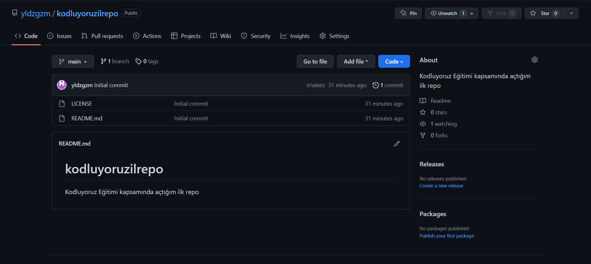

# Kodluyoruz Ilk Repo
Bu repo [Kodluyoruz](https://www.kodluyoruz.org) Front-End Eğitiminde oluşturduğumuz ilk repo. İçerisinde bir adet README dosyası, bir adet de index.html barındırıyor.
<br>

<br>
##Installation
Öncelikle projeyi clonelayın. 
<br>
```
git clone https://github.com/yldzgzm/kodluyoruzilrepo.git
```
## Usage
Projeyi cloneladıktan sonra Visual Studio Code programında açınız.
<br><br>
Linux için:
<br>
```
cd kodluyoruzilkrepo
code.
```
##Contributing
Pull requestler kabul edilir. Büyük dedğişiklikler için,lütfen önce neyi değiştirmek istediğinizi tartışmak için bir konu açınız.
##License
[MIT](https://choosealicense.com/licenses/mit/)
